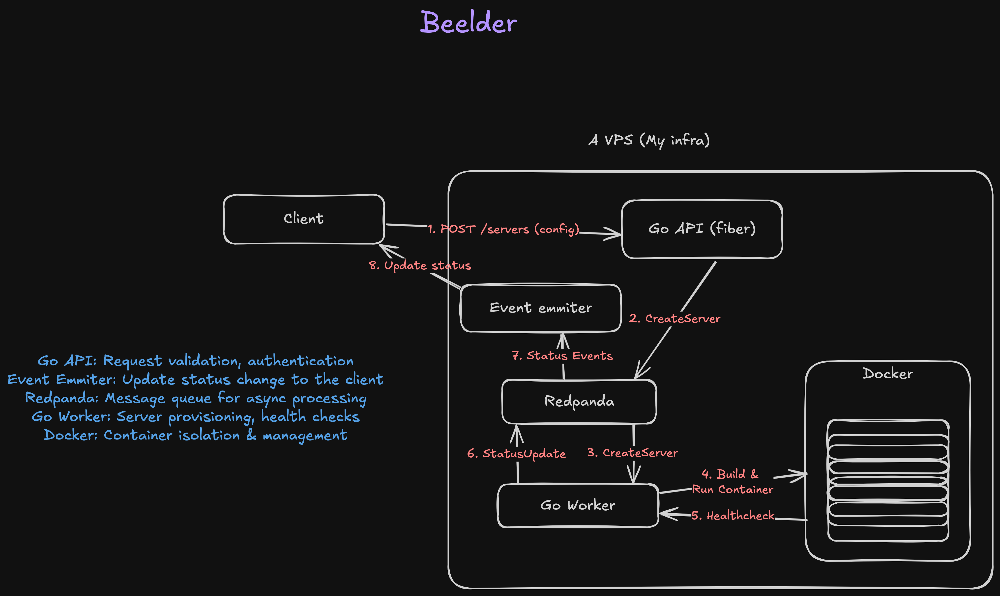

# Beelder

[](https://go.dev/)
[](LICENSE)
[](https://www.docker.com/)
[](https://redpanda.com/)

> A learning project that replicates a Minecraft server platform using Go, demonstrating event-driven architecture, containerization, and the Strategy pattern.

---

## 🚀 Features

- **Dynamic Server Provisioning** - Create Minecraft servers on-demand
- **Multi-Type Support** - Paper, Forge, and Fabric servers via Strategy Pattern
- **Real-Time Updates** - SSE-based status notifications
- **Event-Driven Architecture** - Kafka/RedPanda for async processing
- **Docker Isolation** - Each server runs in its own container
- **Concurrent Builds** - Up to 3 servers building simultaneously
- **Plan-Based Resources** - Free, Budget, and Premium tiers

---

## 📋 Quick Start

### Prerequisites

```bash
# Required
- Go 1.21+
- Docker
- RedPanda (Kafka-compatible)
```

### Installation

```bash
# Clone the repository
git clone https://github.com/SGuzmanBeltran/beelder.git
cd beelder

# Start dependencies (Kafka/RedPanda)
docker-compose up -d

# Run API server
cd core/cmd/api
go run main.go

# Run Worker (in another terminal)
cd core/cmd/worker
go run main.go
```

---

### Slices
#### First slice
In the first slice I desire that we have the creation server flow, the user is allow to create a server based on a configuration and the system report the progress of
creation.

**Configuration Options:**
- Server name/MOTD
- Server type (Paper 1.21.x initially)
- Player count (affects memory allocation)
- Plan type (free, budget, premium)
- Difficulty (Peaceful, Easy, Normal, Hard)
- Online mode (official Minecraft accounts only)

**The progress states the server should report will be:**
- Created
- Creating
- Aborted
- Running
- Stopped

**User Experience:**
- Server connection details once ready
- Create the server based on a configuration

**Definition of Done:**
- User can create a server through API
- Server starts successfully and accepts connections
- Progress is tracked
- Basic server info is accessible (IP, port, status)

**TODO**
1. [x] Enable configuration.
    - [x] Receive configuration as an JSON in the endpoint
    - [x] Send the configuration in the broker message
    - [x] Receive the configuration in the broker consumer
2. [x] Create the server based on configuration.
3. [x] Create the server using different strategies (Server types like Paper, Forge, Fabric).
4. [x] Creating a server is a concurrent service where max 3 server can be created at a time. Max 5 servers.
5. [x] Communicate the server creation progress using a broker.
6. [x] Refactor server templates to use Strategy Pattern

## Architecture



**Flow:**
1. Client sends server creation request to API
2. API validates and publishes to Kafka
3. Worker consumes message and begins provisioning
4. Worker builds and deploys Docker container
5. Worker performs health checks
6. Worker publishes status updates to Kafka
7. Event Emitter broadcasts to connected clients
8. Client receives real-time status updates

For detailed component responsibilities, see [ARCHITECTURE.md](ARCHITECTURE.md).